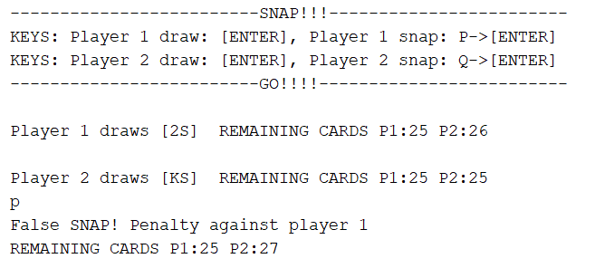

# Snap

Play a game of snap with your friends!

Instructions:  
Press [ENTER] to draw a card (players alternating the turns).

Note:
+ Player 1 type [P] then press [ENTER] to snap.
+ Player 2 type [Q] then press [ENTER] to snap.
 

